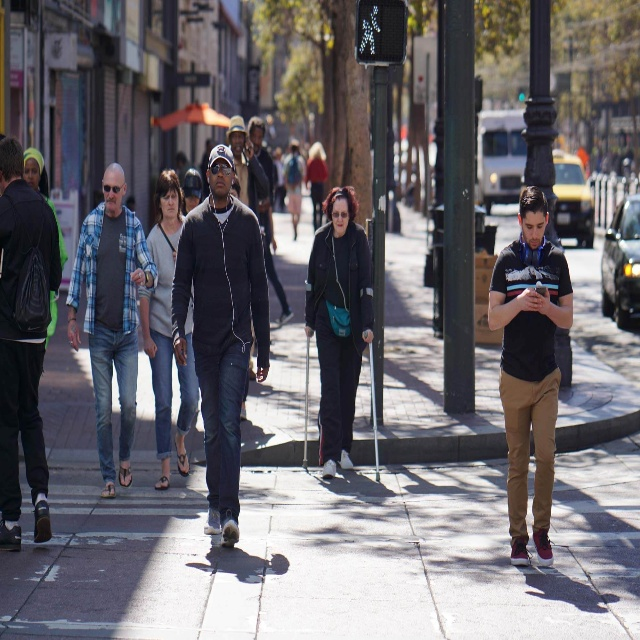

# 🚶‍♂️ Real-Time Pedestrian Detection System


A high-performance Computer Vision pipeline for real-time pedestrian detection. This project leverages the **YOLOv8** architecture to identify people in static images and video streams, featuring automated hardware optimization for **NVIDIA CUDA**.

---

## 📸 Proof of Concept
To demonstrate the model's accuracy, here is a comparison between a raw input frame and the processed output with bounding boxes and tracking ID.

| Original Input | Detection Result |
| :---: | :---: |
|  |  |

---

## 🌟 Key Features
* **Hardware Acceleration**: Automatic detection of **CUDA GPU** with seamless fallback to CPU.
* **Real-Time Performance**: Optimized inference logic suitable for live camera streams.
* **Automated Testing Suite**: Full validation of hardware, media integrity, and model output via **Pytest**.
* **Modular Design**: Decoupled detection logic for easy integration into larger AI pipelines.

---

## 🛠️ Project Structure
```text
.
├── assets/              # Test images and sample videos
├── src/                 # Core detection and logic source code
├── tests/               # Automated test suite (Pytest)
├── models/              # YOLOv8 pre-trained weights (.pt)
├── test_results/        # Output gallery for documentation
├── requirements.txt     # Project dependencies
└── README.md            # Project documentation
